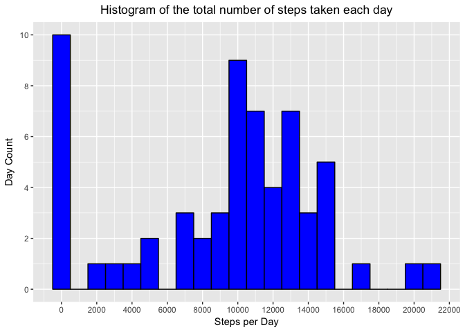
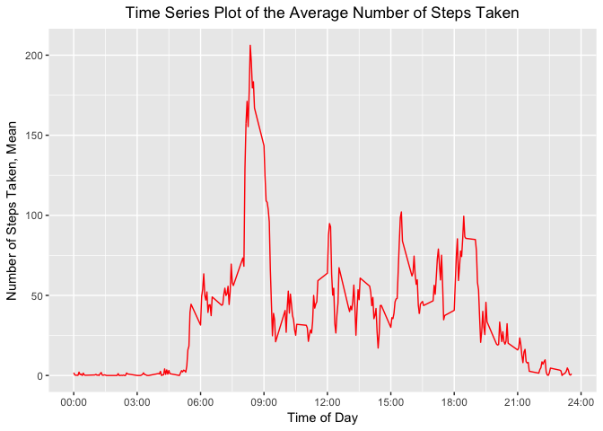
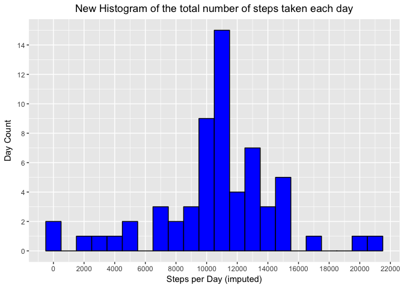
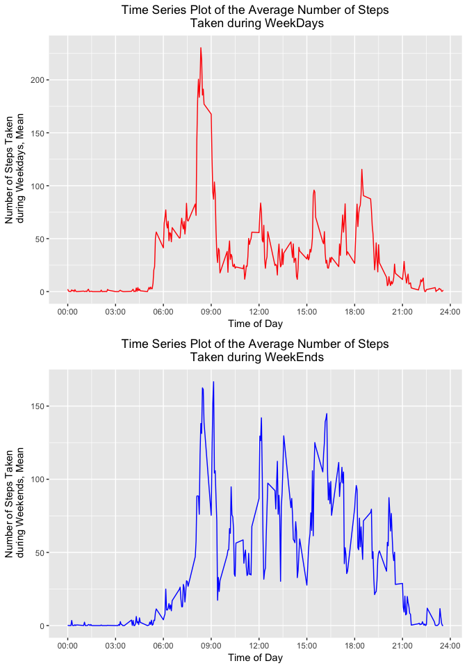

# Reproducible Research: Peer Assessment 1
Author: Jay Sabido
Date: July 3, 2017

## Introduction

It is now possible to collect a large amount of data about personal
movement using activity monitoring devices such as a
[Fitbit](http://www.fitbit.com), [Nike
Fuelband](http://www.nike.com/us/en_us/c/nikeplus-fuelband), or
[Jawbone Up](https://jawbone.com/up). These type of devices are part of
the "quantified self" movement -- a group of enthusiasts who take
measurements about themselves regularly to improve their health, to
find patterns in their behavior, or because they are tech geeks. But
these data remain under-utilized both because the raw data are hard to
obtain and there is a lack of statistical methods and software for
processing and interpreting the data.

This assignment makes use of data from a personal activity monitoring
device. This device collects data at 5 minute intervals through out the
day. The data consists of two months of data from an anonymous
individual collected during the months of October and November, 2012
and include the number of steps taken in 5 minute intervals each day.


## Data

The data for this assignment can be downloaded from the course web
site:

* Dataset: [Activity monitoring data](https://d396qusza40orc.cloudfront.net/repdata%2Fdata%2Factivity.zip) [52K]

The variables included in this dataset are:

* **steps**: Number of steps taking in a 5-minute interval (missing
    values are coded as `NA`)

* **date**: The date on which the measurement was taken in YYYY-MM-DD
    format

* **interval**: Identifier for the 5-minute interval in which
    measurement was taken


The dataset is stored in a comma-separated-value (CSV) file and there
are a total of 17,568 observations in this dataset.


## Loading and preprocessing the data

Since the data already exists in the repository, I just need to unzip it. The data is then read into a data frame.

Pre-processing involves:
* converting the steps variable into numeric
* converting the date into date class
* adding a weekdays variable
* determining if the weekday falls on a weekend or not


```r
# load the data
unzip("activity.zip")     # file already exists in the repository. Just need to unzip it
# read the csv file
activity <- read.csv("activity.csv", header = TRUE, na.strings = "", stringsAsFactors = FALSE)     
# Pre=process the data
activity$steps <- as.numeric(activity$steps)     # convert to numeric
```

```
## Warning: NAs introduced by coercion
```

```r
activity$date <- as.Date(activity$date)     # convert to date
activity$wday <- weekdays(activity$date)     # get the weekday

# determine if weekend. Since only Saturday and Sunday, use grepl. TRUE if weekend.
activity$wend <- grepl("^S", activity$wday)
```


## What is mean total number of steps taken per day?

1. Calculate the total number of steps taken per day


```r
library("plyr")
actStatsDate <- ddply(activity, .(date), summarise, TotalSteps = sum(steps, na.rm = TRUE))     # get the steps per day
```
 
                    
2. Make a histogram of the total number of steps taken each day


```r
library("ggplot2")
g <- ggplot(actStatsDate, aes(TotalSteps))
g1 <- g + geom_histogram(color = "black", fill = "blue", binwidth = 1000)
g2 <- g1 + labs(title = "Histogram of the total number of steps taken each day") + 
  theme(plot.title = element_text(hjust = 0.5)) + labs(x = "Steps per Day", y = "Day Count") 
g3 <- g2 + scale_y_continuous(breaks=seq(0,10,2)) + scale_x_continuous(breaks = seq(0,22500, 2000))
print(g3)
```

<!-- -->

I used [this reference](http://www.sthda.com/english/wiki/ggplot2-axis-ticks-a-guide-to-customize-tick-marks-and-labels) to customize the tick marks and labels in ggplot2.

Note that the plot shows 10 out of the 61 days with 1,000 steps or less. 


3. Calculate and report the mean and median of the total number of steps taken per day


```r
MeanStepsPerDay <- round(mean(actStatsDate$TotalSteps, na.rm = TRUE), digits = 0)
MedianStepsPerDay <- round(median(actStatsDate$TotalSteps, na.rm = TRUE), digits = 0)
```

The mean of the total number of steps taken per day is 9354, 
while the median is 1.0395\times 10^{4}.


## What is the average daily activity pattern?

1. Make a time series plot (i.e. `type = "l"`) of the 5-minute interval (x-axis) and the average number of steps taken, averaged across all days (y-axis)

First, I need to calculate the mean for each interval across all days. Then, I will use ggplot to plot the time series plot.


```r
actStatsInt <- ddply(activity, .(interval), summarise, IntervalMean = mean(steps, na.rm = TRUE))

# Plot using ggplot2
gt <- ggplot(actStatsInt, aes(interval, IntervalMean)) 
gt1 <- gt + geom_line(color = "red") 
gt2 <- gt1 + scale_x_continuous(breaks=c(0,300, 600, 900, 1200, 1500, 1800, 2100, 2400), 
                                labels = c("00:00","03:00", "06:00", "09:00", "12:00", "15:00", "18:00", "21:00", "24:00"))
gt3 <- gt2 + labs(title = "Time Series Plot of the Average Number of Steps Taken") + 
  theme(plot.title = element_text(hjust = 0.5)) + labs(x = "Time of Day", y = "Number of Steps Taken, Mean") 
print(gt3)
```

<!-- -->

This time series is very interesting. Prior to 5 am, there is hardly no activity. But once the day starts at around 5 am, the number of steps increases, peaking at around 8:30 am. During the day, from 9:00 am to 6:30 pm, the person is a bit active. But the person's activity dies down in the evening.


2. Which 5-minute interval, on average across all the days in the dataset, contains the maximum number of steps?

To answer this, I need to get the row with the maximum average number of steps.


```r
library("dplyr")
```

```
## 
## Attaching package: 'dplyr'
```

```
## The following objects are masked from 'package:plyr':
## 
##     arrange, count, desc, failwith, id, mutate, rename, summarise,
##     summarize
```

```
## The following objects are masked from 'package:stats':
## 
##     filter, lag
```

```
## The following objects are masked from 'package:base':
## 
##     intersect, setdiff, setequal, union
```

```r
MaxInterval <- filter(actStatsInt, IntervalMean == max(IntervalMean))
```

The 835 time interval contains the maximum number of steps.
The maximum number of steps is 206.


## Imputing missing values

1. Calculate and report the total number of missing values in the dataset (i.e. the total number of rows with `NA`s)


```r
colSums(is.na(activity))
```

```
##    steps     date interval     wday     wend 
##     2304        0        0        0        0
```

There are 2304 rows with NA's.


2. Devise a strategy for filling in all of the missing values in the dataset. 
The strategy does not need to be sophisticated. 
For example, you could use the mean/median for that day, or the mean for that 5-minute interval, etc.

My chosen strategy for filling in all of the missing values in the dataset:  
I decided to use the mean for that 5-minute interval, for the 2-month period. 
This is a better representation than the mean for that day in my opinion since the steps vary per time of day. Since the means per 5-minute time interval have already been calculated, I just have to integrate these via the plyr::join function.


```r
activity <- join(activity, actStatsInt, by = "interval")  
for (i in 1:length(activity$steps)) {
  if (is.na(activity$steps[i])) {activity$steps[i] <- activity$IntervalMean[i]}
}
```


3. Create a new dataset that is equal to the original dataset but with the missing data filled in.


```r
NewActivity <- select(activity, steps:interval)
```


4. Make a histogram of the total number of steps taken each day 


4.1 Histrogram


```r
NewActStatsDate <- ddply(NewActivity, .(date), summarise, TotalSteps = sum(steps, na.rm = TRUE))

g <- ggplot(NewActStatsDate, aes(TotalSteps))
g1 <- g + geom_histogram(color = "black", fill = "blue", binwidth = 1000)
g2 <- g1 + labs(title = "New Histogram of the total number of steps taken each day") + 
  theme(plot.title = element_text(hjust = 0.5)) + labs(x = "Steps per Day (imputed)", y = "Day Count") 
g3 <- g2 + scale_y_continuous(breaks=seq(0,16,2)) + scale_x_continuous(breaks = seq(0,22500, 2000))
print(g3)
```

<!-- -->

About 15 out of the 61 days, the person has 11,000 to 12,000 steps; 9 days between 10,000 to 11,000 steps.


4.2. Calculate and report the **mean** and **median** total number of steps taken per day. 


```r
NewMeanStepsPerDay <- round(mean(NewActStatsDate$TotalSteps, na.rm = TRUE), digits = 0)
NewMedianStepsPerDay <- round(median(NewActStatsDate$TotalSteps, na.rm = TRUE), digits = 0)
```

The mean of the total number of steps taken per day is 1.0766\times 10^{4}, 
while the median is 1.0766\times 10^{4}.


4.3. Do these values differ from the estimates from the first part of the assignment? 

Yes, the values differ a bit. The mean and median are higher with imputed values.


4.4. What is the impact of imputing missing data on the estimates of the total daily number of steps?

The impact of imputting missing data is to increase the mean and median slightly. These are expected since mean values are replaced.


## Are there differences in activity patterns between weekdays and weekends?

For this part the `weekdays()` function may be of some help here. Use the dataset with the filled-in missing values for this part.

1. Create a new factor variable in the dataset with two levels -- "weekday" and "weekend" indicating whether a given date is a weekday or weekend day.


```r
NewActivity$wday <- weekdays(NewActivity$date)     # get the weekday
NewActivity$NoWork <- as.factor(grepl("^S", NewActivity$wday))
levels(NewActivity$NoWork) <- c("weekday", "weekend")
```


2. Make a panel plot containing a time series plot (i.e. `type = "l"`) of the 5-minute interval (x-axis) and the average number of steps taken, averaged across all weekday days or weekend days (y-axis).


```r
# separate the data into two data frames, one for weekdays, the other for weekends
WeekdayData <- subset(NewActivity, NoWork == "weekday")
WeekendData <- subset(NewActivity, NoWork == "weekend")

# Generate the plot for Weekdays
WDayStatsInt <- ddply(WeekdayData, .(interval), summarise, IntervalMean = mean(steps, na.rm = TRUE))

gd <- ggplot(WDayStatsInt, aes(interval, IntervalMean)) 
gd1 <- gd + geom_line(color = "red") 
gd2 <- gd1 + scale_x_continuous(breaks=c(0,300, 600, 900, 1200, 1500, 1800, 2100, 2400), 
                                labels = c("00:00","03:00", "06:00", "09:00", "12:00", "15:00", "18:00", "21:00", "24:00")) + scale_y_continuous(breaks=c(0,50,100,150,200,250))
gd3 <- gd2 + labs(title = "Time Series Plot of the Average Number of Steps\n Taken during WeekDays") + 
  theme(plot.title = element_text(hjust = 0.5)) + labs(x = "Time of Day", y = "Number of Steps Taken\n during Weekdays, Mean") 
# print(gd3)

# Generate the plot for Weekends
WEndStatsInt <- ddply(WeekendData, .(interval), summarise, IntervalMean = mean(steps, na.rm = TRUE))

ge <- ggplot(WEndStatsInt, aes(interval, IntervalMean)) 
ge1 <- ge + geom_line(color = "blue") 
ge2 <- ge1 + scale_x_continuous(breaks=c(0,300, 600, 900, 1200, 1500, 1800, 2100, 2400), 
                                labels = c("00:00","03:00", "06:00", "09:00", "12:00", "15:00", "18:00", "21:00", "24:00")) + scale_y_continuous(breaks=c(0,50,100,150,200,250))
ge3 <- ge2 + labs(title = "Time Series Plot of the Average Number of Steps\n Taken during WeekEnds") + 
  theme(plot.title = element_text(hjust = 0.5)) + labs(x = "Time of Day", y = "Number of Steps Taken\n during Weekends, Mean") 
# print(ge3)

# Generate the panel plot using the gridExtra package
library(gridExtra)
```

```
## 
## Attaching package: 'gridExtra'
```

```
## The following object is masked from 'package:dplyr':
## 
##     combine
```

```r
grid.arrange(gd3, ge3, nrow = 2, ncol = 1)
```

<!-- -->

Yes, there are differences in activity patterns between weekdays and weekends. Although the activity of the person picks up later during the weekends (sleeping in), the person remains more active during the rest of the day, as compared to during weekedays. And the person stays active until later during the day, including the night hours.


Let's compare the average number of steps per weekday.


```r
NewActStatsDate1 <- ddply(NewActivity, .(date), summarise, TotalSteps = sum(steps, na.rm = TRUE))
NewActStatsDate1$wday <- weekdays(NewActStatsDate1$date) 
NewActStatsPerDay <- ddply(NewActStatsDate1, .(wday), summarise, MeanStepsPerDay = mean(TotalSteps, na.rm = TRUE))
NewActStatsPerDay$wday <- factor(NewActStatsPerDay$wday, levels= c("Sunday", "Monday", 
                                         "Tuesday", "Wednesday", "Thursday", "Friday", "Saturday"))
NewActStatsPerDay <- arrange(NewActStatsPerDay, wday)
NewActStatsPerDay
```

```
##        wday MeanStepsPerDay
## 1    Sunday       12088.774
## 2    Monday       10150.709
## 3   Tuesday        8949.556
## 4 Wednesday       11676.910
## 5  Thursday        8496.465
## 6    Friday       12005.597
## 7  Saturday       12314.274
```

Note that there are most steps taken during Saturday and Sunday; i.e., during the weekends.
